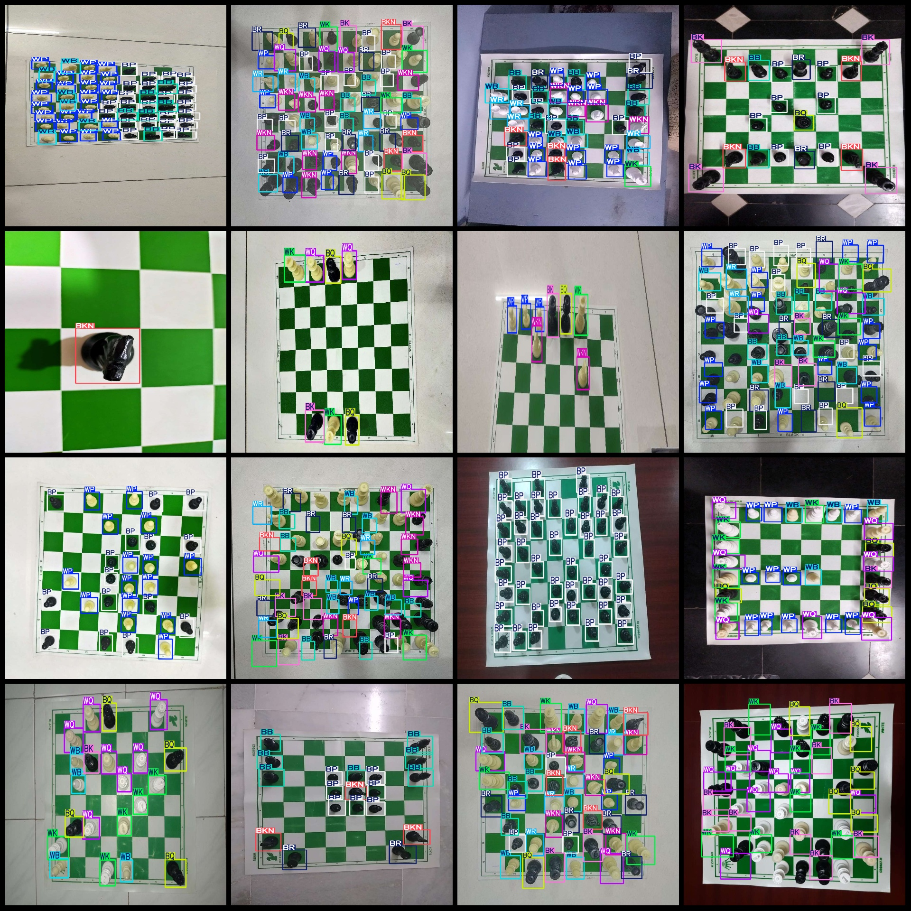
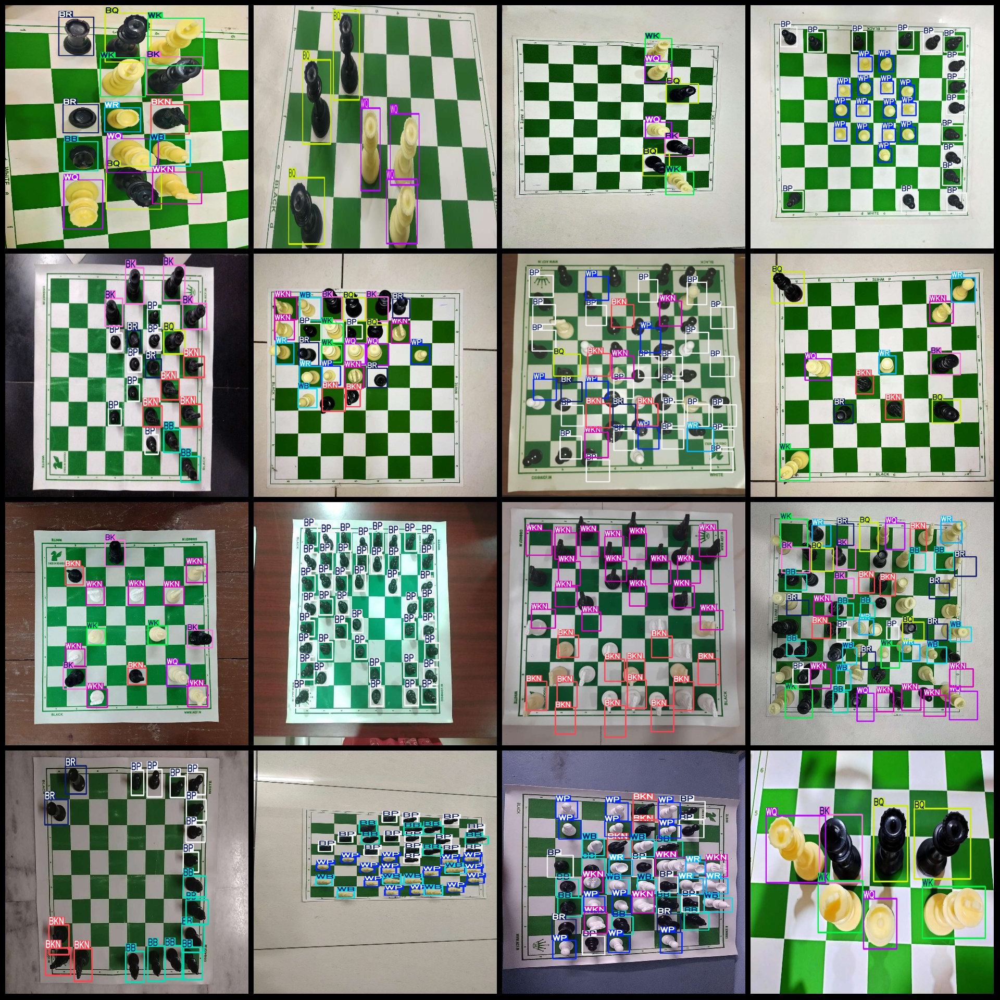

# Chinese Chess Detection Data Set VOC+YOLO Format with 2149 Images in 12 Categories

The dataset format is Pascal VOC format + YOLO format (the txt file does not contain the split path, it only contains the jpg images and the corresponding VOC format xml files and YOLO format txt files).
number of images: 2149  
annotation count: 2149  
annotation count: 2149  
annotationnumber of classes: 12  
Annotation class names: ["BB", "BK", "BKN", "BP", "BQ", "BR", "WB", "WK", "WKN", "WP", "WQ", "WR"]
boxes per class:   
BB box count = 4651  
BK box count = 3155  
BKN box count = 4296  
BP box count = 14230  
The number of BQ frames = 3073
BR box count = 4800  
WB box count = 4611  
WK box count = 3217  
WKN Frames = 4775
WP frame count = 8370
WQ box count = 3550  
WR Frames = 3155
total boxes: 61883  
Number of images per category:
BB occupies the number of pictures = 1126
BK images = 1303  
BKN occupies 1215 images.
BP images = 1187  
BQ images = 1327  
BR images = 1313  
WB images = 1072  
WK images = 1183  
WKN has 1088 images.
WP has 962 images.
WQ images = 1150  
WR images = 936  
Image resolution: Multi-resolution images such as 1024x1024, 1024x768, etc.
Using annotation tool: labelImg
Rules for Annotation: Draw a rectangle around categories.
Important Note: The dataset does not have separate training, validation, and test sets. 
Special Statement: This dataset does not guarantee the accuracy of the trained model or weight files.
Image preview:
## Images

Here is a pay link on Stripe ( https://buy.stripe.com/3cs8yP7sY87d0vu9AB ). Please contact me lonlonago@foxmail.com after funding $89, and I will send you a complete data files , thank you!

